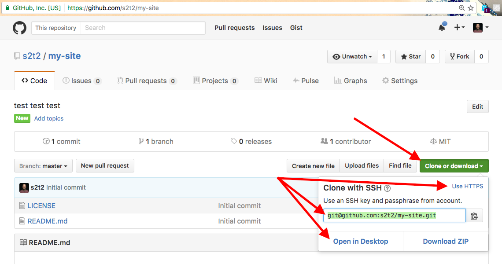

# Website Structure

Create your own static website from scratch, work on it in a local development environment, and publish your site online.

## Objectives

  1. Practice developing websites in a local environment.
  * Use a text editor to create and manage text files.
  * Gain familiarity with HTML.
  * Practice software version control.
  * Practice website hosting.

## Prerequisites

  1. ["Website Hosting" Exercise](/exercises/open-source/exercise.md).
  2. Configure a local development environment to include a text editor, a web browser, a local web server, and a version control client (GitHub Desktop).

## Instructions

### Creating a Remote Repository

Create a new repository on GitHub named something like "my-site".

Note the repository's remote address, then click the "Open in Desktop" button or "clone" it using GitHub Desktop. This should download a copy of the repository onto your local machine, in your desired location ,like .



### Downloading the Repository

Find the location of the website repository on your local machine, navigate to it from the command line, and open it with a text editor of choice:

```` sh
cd my-site/
code .
````

> NOTE: Subsequent instructions assume you have navigated to the root directory of the local repository. Some commands, like running the local web server, will only work if executed from within the root directory of your repository.

#### Running a Local Webserver

After navigating to your website repository's root directory, start a local web server on port 8888:

```` sh
# Mac Terminal / Git Bash:
python -m SimpleHTTPServer 8888 &

# Windows Command Prompt:
python –m http.server 8888
````

Finally, visit [localhost:8888](localhost:8888) in a web browser.

#### Creating an HTML Document

Use your text editor to create a new file in the "my-site" directory called "index.html".

Edit the "index.html" file using your text editor of choice. Add basic HTML page structure (`html`, `head`, `body`, etc.), leveraging your text editor's auto-completion functionality. It will probably generate content like the following:

```` html
<!DOCTYPE html>
<html>
  <head>
    <meta charset="utf-8">
    <title>My Site</title>
  </head>
  <body>

  </body>
</html>
````

Save the file and preview it in the browser. What do you notice? Try revising the text inside the `title` tag and noticing what changes.

### Editing HTML Content

To display a top-level page heading, add an `h1` tag and some text within it.

Your code should now resemble:

```` html
<!DOCTYPE html>
<html>
  <head>
    <meta charset="utf-8">
    <title>My Site | A website by me</title>
  </head>
  <body>
    <h1>Welcome to My Site</h1>
  </body>
</html>
````

Save the file and preview it in the browser.

Continue to expand the HTML structure of your website as desired. Refer to the [W3Schools HTML Tutorial](http://www.w3schools.com/html/default.asp) for guidance. Include many of the HTML elements covered therein. Take your time to develop a baseline comfort with these elements.

As you develop your website, use an iterative development approach. Focus on small tasks one at a time. Edit your HTML file(s), preview your changes, then commit your changes. Then repeat the process.

Every so often, use GitHub Desktop to push / sync your local changes up to the remote repository, where should be able to view them on GitHub.

Nice Job! You are developing like a pro!
